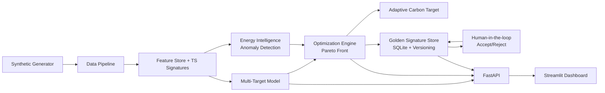

# AI-Driven Manufacturing Intelligence

End-to-end project for **batch-level optimization** of energy and carbon emissions while preserving quality, yield, and throughput performance.

## Capabilities
- Synthetic manufacturing data generation with process parameters, energy profiles, outcomes, and operational metadata.
- Data pipeline for cleaning, validation, and feature engineering including time-series signature features.
- Baseline multi-target prediction for quality, yield, performance, and energy.
- Energy pattern intelligence (RMS, peaks, FFT bands, shape stats) with anomaly detection.
- Multi-objective Pareto optimization + adaptive carbon target computation.
- Golden signature store (SQLite-backed), versioning, and human-in-the-loop accept/reject updates.
- Continuous learning behavior: accept signature updates only when new outcomes are superior.
- FastAPI inference and optimization service.
- Streamlit dashboard for prediction, energy profile/anomaly visuals, and Pareto candidate inspection.
- Pytest test coverage for core modules.

## Architecture


## Project layout
- `src/aimi/generator.py` - synthetic batch + profile generation.
- `src/aimi/pipeline.py` - cleaning, validation, feature engineering.
- `src/aimi/energy_intelligence.py` - signature extraction + anomaly scoring.
- `src/aimi/modeling.py` - baseline multi-target regression.
- `src/aimi/optimization.py` - Pareto optimization, adaptive targets, golden signature store.
- `src/aimi/api.py` - FastAPI endpoints.
- `src/aimi/dashboard.py` - Streamlit app.
- `tests/` - pytest suite.

## Quickstart
```bash
python -m pip install -e '.[dev]'
pytest -q
```

## Generate synthetic data
```bash
python -m aimi.cli generate --batches 200 --output data/synthetic_batches.csv --profile-output data/synthetic_profiles.csv
```

## Run API
```bash
uvicorn aimi.api:app --host 0.0.0.0 --port 8000 --reload
```
Endpoints:
- `GET /health`
- `POST /predict`
- `POST /optimize`
- `GET /golden-signature`
- `POST /golden-signature`

## Run dashboard
```bash
streamlit run src/aimi/dashboard.py --server.port 8501
```

## Example API payloads
`POST /predict`
```json
{
  "row": {
    "machine_age_years": 4,
    "maintenance_score": 0.9,
    "operator_skill": 0.82,
    "setpoint_temp": 70,
    "pressure": 5.3,
    "feed_rate": 120,
    "cycle_time": 46,
    "carbon_intensity": 0.42,
    "emissions_factor": 1.02,
    "rms": 41,
    "peak": 52,
    "peak_to_avg": 1.2,
    "shape_skew": 0.1,
    "shape_kurtosis": -0.5,
    "crest_factor": 1.3,
    "fft_low": 2000,
    "fft_mid": 700,
    "fft_high": 300,
    "energy_per_output": 12,
    "temp_pressure_interaction": 371
  }
}
```

## Make targets
```bash
make install
make test
make api
make dashboard
make synthetic
```
